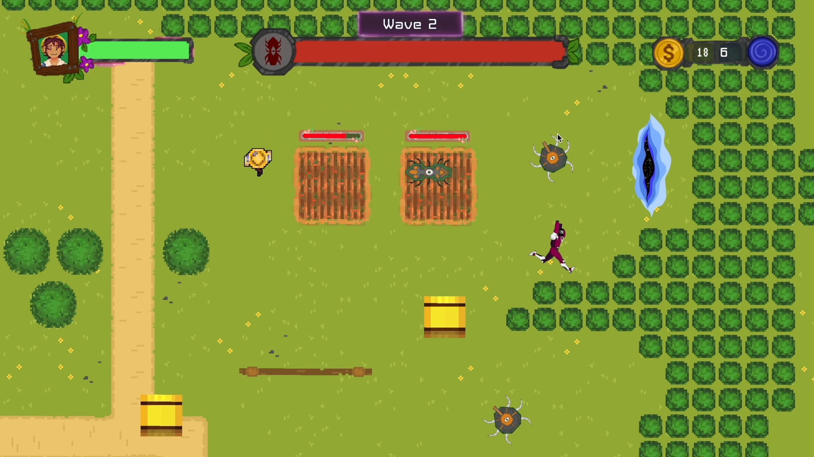

# Dimensional-Rift
 

Sam, a bounty hunter from the future, is at the end of their rope when by a stroke of luck, a portal opens into another dimension. When Sam leaps through to escape, bringing along hordes of aliens in pursuit, she meets Freida, a farmer leading a peaceful life with a dream of building a successful farm. In this co-op game, help Sam protect Freida as she grows her farm and earns money to in turn help Sam grow stronger! Just keep in mind, both characters can only move in the dimensions of their original game worlds!

Dimensional Rift is played with a keyboard and mouse. 
Freida is moves with WASD and space to harvest farms and grab hay bales. 
Sam moves with the arrow keys, using the mouse to aim, left click to fire, and right-click to change weapons.
To start a wave, players must stand near each other.
